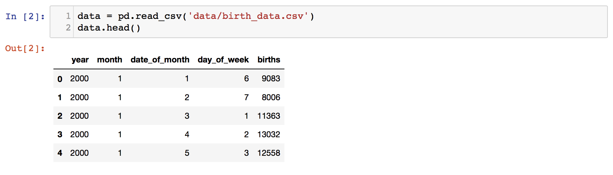
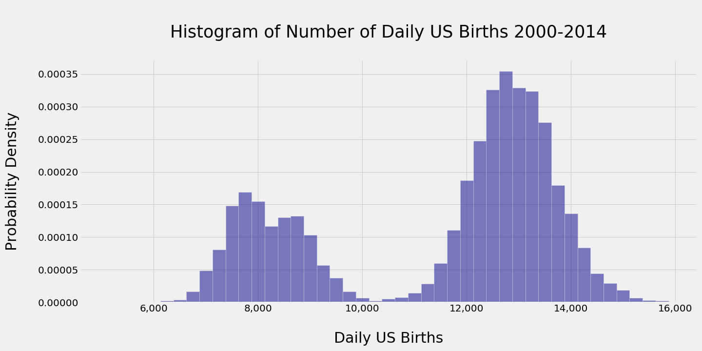
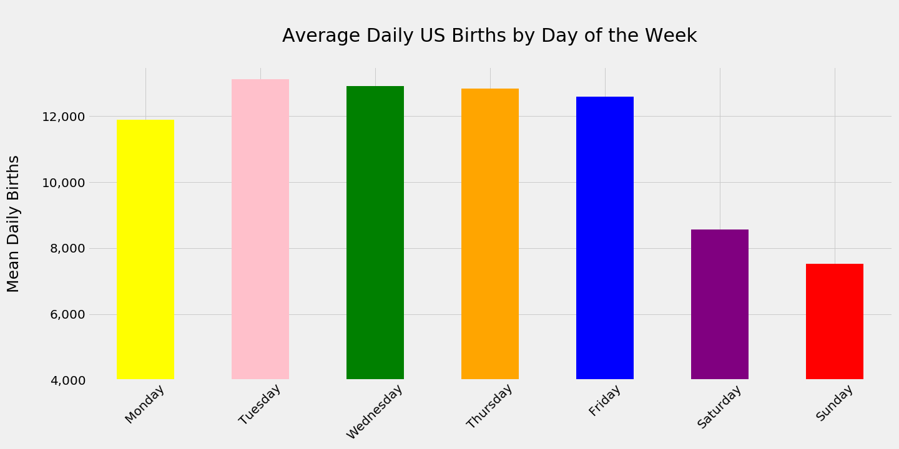
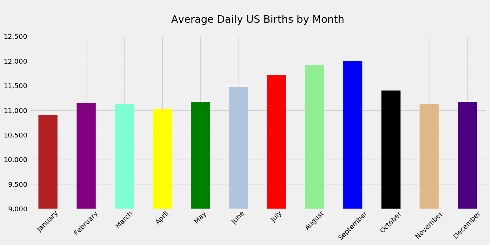
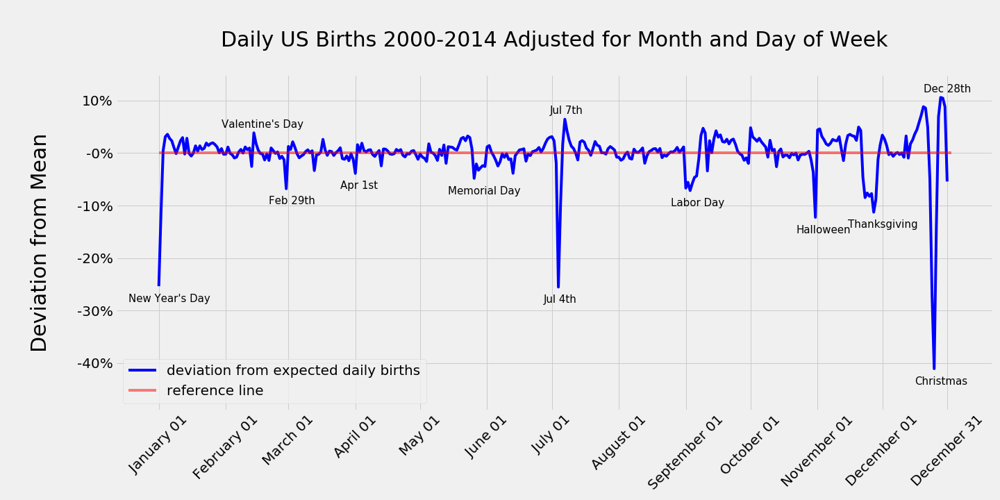
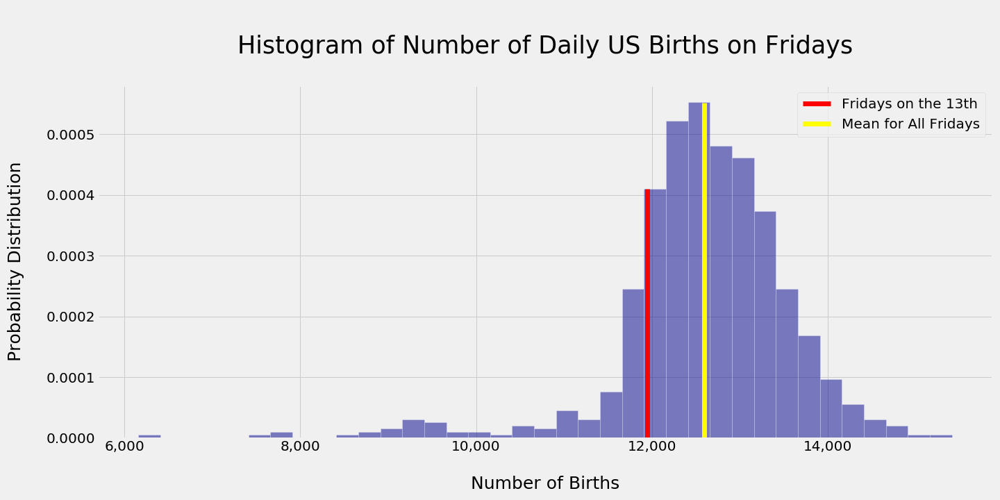

## Analysis of Daily US Births

Given the uncertainties around childbirth, one might expect little variation in the number of babies born on one day to the next. However, knowing that over 98% of births in the US occur in a hospital and around 50% of these births are pre-scheduled (either cesarian section or induction) might alter this expectation.  In this analysis, we explore the patterns that underlie the variations in the number of daily US births.  

## Data Source

Daily US birth data 2000-2014 courtesy of [fivethirtyeight](https://github.com/fivethirtyeight/data/blob/master/births/US_births_2000-2014_SSA.csv).  The data is structured as shown below.



## Installation

For those interested in downloading the notebook and running the scripts, the [requirements.txt](requirements.txt) file is included. As is customary, the following shell command will ensure the necessary packages are installed to a local virtual environment.  

```
pip install -r requirements.txt
``` 

## Exploratory Data Analysis


### Histogram Of US Daily Births

A casual examination of a histogram of the number of daily US births immediately suggests that births in the US do not conform to a normal distribution.  Note the bimodal nature of the distribution.



### Daily US Births by Day of the Week

An explanation of the bimodal distribution of daily US births becomes apparent with an analysis of the mean daily births for each day of the week.  The distributions for weekdays and weekends are distinct.



### Daily US Births by Month

There is significant variation in the average number of daily US births from one month to the next.  Note the higher number of births in the summer months.



### Daily US Births over the Year

Even when normalized for month and day of the week, significant variations in the number of daily US births occur on particular dates.  Namely, there are significantly fewer births on US holidays as well as other dates (notably Feb 29th, Apr 1st, and Oct 31st).  Another more subtle pattern is visible with careful inspection of the time period shortly before the midpoints of most months. 



### Histogram of Daily US Births on Fridays

Careful inspection of the prior plot suggests that a periodic fall in daily births occurs shortly before the midpoints of most months.  Evaluation of the 13th of each month reveals fewer births occur on this date than other days of the month.  When Fridays that fall on the 13th are examined, fewer births appear to occur on these days than Fridays that fall on other days of the month.  The mean number of births on Fridays that fall on the 13th of the month represent the 15.7th percentile for all Friday births. 



## Conclusion

It is evident that the number of babies born in the US on any given day is not uniformly distributed.  More babies are born on weekdays than on weekend days.  More babies are born during the summer months than during other months.  Fewer babies are born on national holidays.  Additionally, fewer babies are born on other dates including February 29th, April 1st, Halloween and on Fridays that fall on the 13th of the month.        
